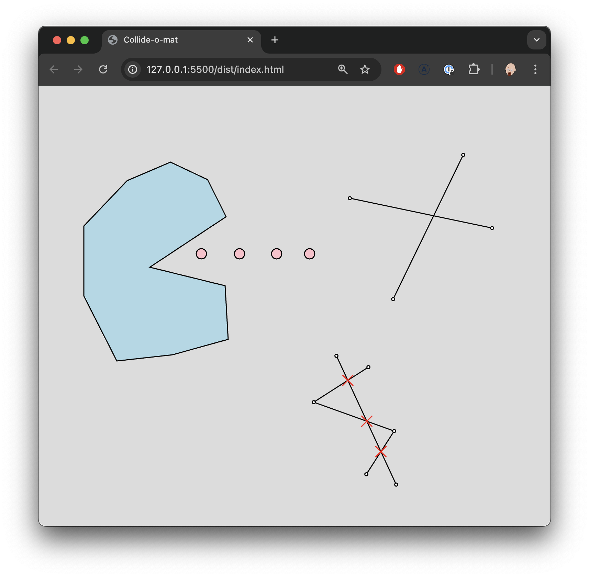
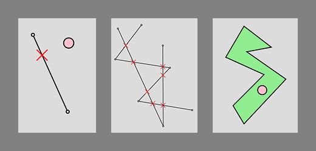

# Collision Detection

**NOTE:** for general advice on how to get, edit, and submit homework, check out
the [GENERAL.MD](GENERAL.MD) file. That will be the case for all homeworks.

## Overview

This homework comes full circle from the beginning of the semester when we
covered the axis-aligned bounding box. We're back to doing geometry!

Collision detection is a routine thing in many application areas: modeling
tools, games, physics simulations, etc. This homework is all about a small set
of 2D collision detection fundamentals. Namely:

- Given point P and a line segment, what's the closes point on the segment to P?
- Given two line segments, where do they intersect?
- Is a point inside a polygon, even if that polygon is kinda weird?

Graphically (in the spiffy playground thing) these look like thus:

In order to answer these questions, there's a few math functions that you'll
also need to implement:

- What's the distance between points A and B?
- What are the dot product and cross products for two points (vectors) A and B?
- What is the result of adding points (vectors) A and B? And subtraction!
- What is point A, scaled by factor s?

There are a few more to implement, but hopefully the documentation in the source
file and the related test files will be enough to go on.

The more complicated functions (point/segment, segment/segment and
point/polygon) all have pseudocode spelled out for you. They all use the math
functions that you've implemented earlier.

## Resources out there, on the Interwebs

I mention this book: [Real Time Collision Detection by Christer
Ericson](https://github.com/imgaray/EPD/blob/master/doc/Real-Time%20Collision%20Detection.pdf).

This is a subtle attempt to introduce you to the mathy side of game development.
If you have anything to do with game programming, you _will_ need to understand
topics like vectors, matrices, and basic operations that you can do with them.
Many of those basics are covered by this homework assignment. But if you want to
understand them, or maybe be assaulted by incomprehensible math, you can check
out this book.

Don't be discouraged if that book seems impenetrable. Only about a third of it
makes sense to me, and I ostensibly know what I'm doing!

## Specific homework advice

The file you edit for this homework is `collide.ts`.

There are several tests: 13 in total as I type this, but that could change.

Most of the tests cover simple math functions like `dot` and `cross`. If done
concisely, your implementation should be one line long.

As always, start at the top and work your way down.

## Interactive Graphics!

This homework has a fun curve ball: there is a p5js-based playground.

**Note!** You don't have to use the playground at all - it is there for visual
debugging and maybe procrastination purposes. You can still do the homework
entirely by editing the `collide.ts` file until it passes the tests.

To use this, run `npm run build` any time you've made changes. Then, open
`dist/index.html` and run it with Live Server (a VS Code plugin). Then you can
point a browser to
[http://127.0.0.1:5500/dist/index.html](http://127.0.0.1:5500/dist/index.html)
to play!

Click to add points. Shift click to make polylines. You can make polygons by
shift clicking on the first point in a sequence.

The playground will use your math (in `collide.ts`) to show you interesting
things, usually based on only the most recent geoemtry:

- Make a polyline, then click, and it shows you the result of
  `closestPointOnSegment`.
- Make two polylines and it will show you all the intersections they have using your `intersectSegment` implementation.
- Make a polygon and then click somewhere. It will use your `testPointInPolygon`
  code.

To belabor the point: the playground editor won't work out of the box - you have
to implement the functions from the homework. And after you've edited the code,
you have to run `npm run build` for those changes to be picked up by your
browser.
